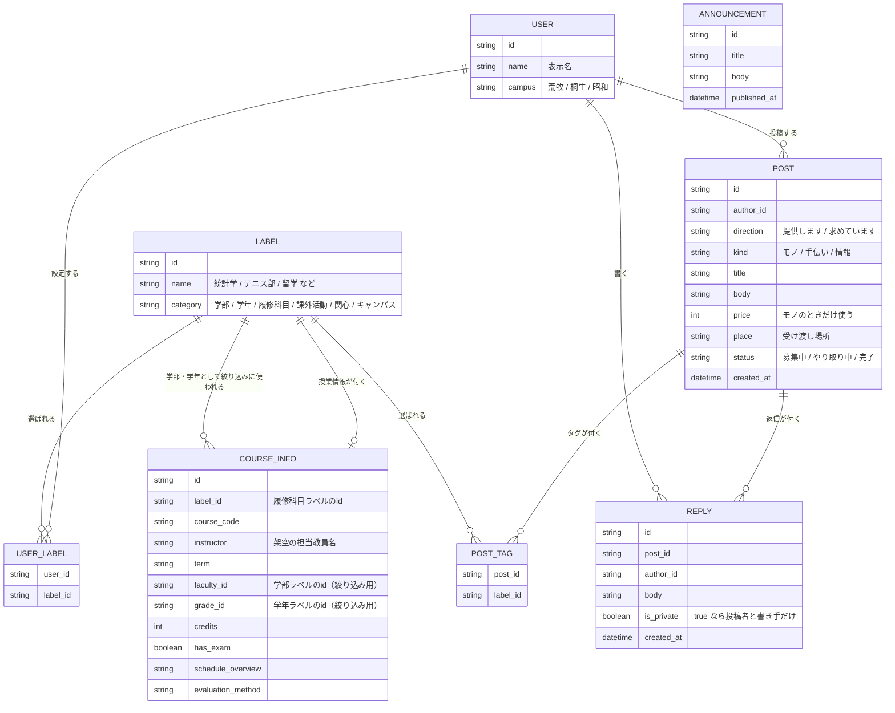

# 企画書：学内のモノ・手・情報が行き交うタイムライン

作成：4名チーム／日付：＿＿＿＿

---

## 1. このアプリを一言で

**学内で欲しいのは、モノを渡してくれる相手や、手伝ってくれる相手だけではありません。** 授業の本当のところや、進路の実感といった、公式には出てこない情報も同じくらい欲しいものです。「今ここにいる、特定の相手」を見つけることと、「縦横に広がる生の情報」を得ることの両方を、学内限定でかなえるタイムラインです。

教科書を売りたい人、引越しを手伝ってほしい人、留学の実感を聞きたい人。大学の中にはこうした要求が常にありますが、今は繋がる場所がありません。SNSでは学外の人にまで届いてしまい、掲示板は誰も見ていない。

このアプリは、学内の全員が同じ場所に投稿し、**受け取る側が自分に関係あるものだけを見る**という形をとります。

---

## 2. なぜこれを作るのか

### 私たちが見つけた課題

チームで話し合ったとき、全員が経験していた困りごとが出てきました。

**① 学内のことなのに情報が入ってこない**
世の中のニュースはSNSで流れてくるのに、大学の中のことは自分から探しに行かないと分からない。

**② 相手が見つからない**
教科書を譲りたくても、それを来年使う人が誰か分からない。手伝ってほしいことがあっても、頼める相手を知らない。

**③ 大事な連絡が埋もれる**
連絡と雑談が同じ場所に流れると、休講のお知らせを見逃す。

**④ 同じような情報ばかり見てしまう**
新型コロナウイルスが流行していた時期、SNSを見ていたら根拠の怪しい情報ばかりが流れてくるようになった経験があります。一度あるジャンルを見ると、似たものばかり表示される仕組みになっているためです。学内でも同じことが起きるなら、対策を最初から入れておきたい。

### この4つは、実は1つの問題です

**モノを渡すのも、手伝ってもらうのも、生の情報を教えてもらうのも、結局は「今ここにいる、特定の相手」を見つけないと成立しません。** 教科書は誰かの本棚にあり、手伝える人はどこかにいて、留学のリアルな話は経験した誰かの頭の中にあります。足りないのは中身ではなく、**その人を見つける仕組み**です。

これは既存サービスが弱いところでもあります。メルカリは相手が誰か分からないままでも成立しますが、教科書の受け渡しや力仕事の依頼、そして「本当のところどうなのか」という情報のやり取りは、相手が「今ここにいる、身元の分かる人」でなければ成立しにくいものです。学内という条件がそのまま強みになる領域に絞っています。

---

## 3. このアプリの中心にある考え方

### 投稿の種類を増やさない

普通なら「フリマ機能」「質問掲示板」「お知らせ欄」を別々に作ります。私たちはそうしません。

**投稿は1種類だけ。違うのはラベルだけ**にします。

投稿を分類する軸は2つしかありません。

|  | モノ | 手伝い | 情報 |
|---|---|---|---|
| **提供します** | 微積の教科書（800円） | 引越し手伝います | 留学の体験談 |
| **求めています** | 統計の教科書を探しています | 実験の記録係を1名 | 教職課程の実態を知りたい |

この6マスで、教科書の売買も、困りごとの相談も、質問や体験談の共有もすべて表現できます。

### なぜこうするのか

**理由1：作る量が6分の1になる。** 投稿フォームも一覧画面も1つで済みます。限られた期間の中で、中身の質に時間を使えます。

**理由2：使う人が迷わない。** 「これはフリマに出すのか掲示板に書くのか」と考えなくてよくなります。書きたいことを書けば、それがどのマスに入るかは後から決まります。

**理由3：想定外の使われ方が生まれる。** 種類を固定しないので、私たちが思いつかなかった投稿も受け入れられます。

### 「情報」のマスは、一度削ってから戻しました

「課題が何のアプリか分かりにくい」という指摘を受けた時期に、**「学内である必然性が一番弱い」という理由で情報のマスを削り、モノ・手伝いの2マスに絞った**ことがあります。留学の体験談は学内のSNSアカウントやLINEグループでも案外足りる、答える側にとって「同じ大学の学生である」ことの意味もそこまで大きくない、というのがそのときの理由でした。

考え直して、戻しました。**このアプリの目玉は、モノや手伝いだけでなく、情報を縦横から得られることだ**と判断したためです。シラバス（§4・付録B）のような公式情報は大学がすでに持っていますが、「実際に履修した先輩の感想」「教育実習は本当に忙しいのか」「留学に実際いくらかかったか」のような情報は公式サイトには載りません。同じ大学の学生同士でなければ、質・量のどちらの面でも交換しにくい情報です。

削っていた判断そのものが誤りだったとは考えていません。「学内である必然性」という基準は今も正しいと考えていますが、**情報のやり取りにも、身元の分かる学内限定であることの価値は十分にある**、という結論に至りました。一度絞って、狙いを立て直してから戻す。これも設計判断の記録として残しています（§15）。

---

## 4. ラベルの仕組み

このアプリの要はラベルです。ラベルは2種類あります。

### 人に付くラベル

利用者が自分で設定します。

- 学部・学年（例：情報学部3年）
- 履修科目（例：統計学、データ構造）
- 課外活動（例：テニス部、軽音サークル）
- 関心（例：留学、教員志望、大学院進学）
- キャンパス（荒牧・桐生・昭和）

### 投稿に付くタグ

投稿するとき、内容に合わせて選びます。種類は人に付くラベルと共通です。

### この2つが重なったところに投稿が届く

「理工学部3年・テニス部・統計学を履修」という人には、

- 統計学の教科書の出品
- テニス部が使う体育館の連絡
- 理工学部3年向けの就活情報

が流れます。逆に、関係のない学部の話は流れてきません。

**科目を特別扱いしないのが設計上のポイントです。** 履修科目を軸にすると教科書は繋がりますが、留学や課外活動が繋がりません。すべてを同じタグ体系に載せることで、どの話題でも同じ仕組みが働きます。

### 履修科目ラベルには、授業情報が付いています

統計学・データ構造・微積といった履修科目のラベルには、試験の有無・授業計画・成績評価の方法などの**授業情報**が付いています。大学からのお知らせ（§6）と同じ**固定のサンプルデータ**で、学生が書き込んで更新する機能は作っていません。

履修科目は、大学の全科目を想定すると数千件になりうる唯一のラベルです。そこで履修科目だけは他のラベルと違う探し方を用意しています（§5）。学部・学年で先に絞り込んでから、見たい科目の「ⓘ」を押すとシラバスが見られます。シラバスの下には、その科目のタグが付いた「提供します」の投稿（教科書の出品など）も一緒に表示されます。

**この「学部・学年で先に絞り込む」やり方は、投稿を作るとき（タグを選ぶとき）とプロフィール編集（履修中・履修済みを選ぶとき）でも同じものを使っています。** 履修科目のラベルが百件を超える規模になった時点で、「探すとき」だけ絞り込みがあって「選ぶとき」は全件がずらっと並ぶ、という食い違いが起きたためです。絞り込みのロジックは1か所（`lib/useCourseDrilldown.ts`）にまとめ、検索タブ・投稿フォーム・プロフィール編集の3か所から使っています。

---

## 5. 画面はどう見えるか

画面（URL）は**1つ**です。ページ遷移はせず、投稿フォームの下に3つのタブ──「提供します」「求めています」「🔍 ラベルを探す」──が並びます。

```
┌──────────────────────────────────┐
│ 📌 大学からのお知らせ                    │
│    停電に伴う休講について        9/12    │
├──────────────────────────────────┤
│ [提供します(5)] [求めています(3)] [🔍探す] │
├──────────────────────────────────┤
│ 表示中のラベル                            │
│ [統計学 ✓] [テニス部 ✓] [情報学部 ✓]     │
│ [留学 ] [教員志望 ]        すべて表示 →   │
├──────────────────────────────────┤
│ 微積の教科書  800円                       │
│ 書き込みあり／荒牧で手渡し                 │
├──────────────────────────────────┤
│ データ構造の教科書譲ります  1000円         │
│ 去年使ったもの／荒牧で手渡し               │
└──────────────────────────────────┘
```

ラベルのボタンを押すと表示が切り替わります。すべてオフにすれば学内の全投稿が見えます。

投稿を書くときも別のページには移りません。画面の中に入力欄が開きます。

### 「タブは増やさない」から「タブで分ける」に変えました

最初は「投稿を1種類にまとめたのだから、画面もタブもメニューも増やさない」という方針でした。実際に動かしてみると、**「提供します」と「求めています」が1本のリストに混ざって見づらいこと、ラベルを探す欄が目立たず気づかれにくいこと**の2つが問題として出てきました。

そこで、**画面（URL）を増やさないという核心は守ったまま、その中をタブで区切る**方針に変えました。ページ遷移が起きるわけではなく、同じ画面の中で表示が切り替わるだけです。

- 「提供します」「求めています」はそれぞれ独立したタブになり、件数もタブに表示されます
- 「🔍 ラベルを探す」もタブの1つになりました。カテゴリ（学部・学年・履修科目・課外活動・関心・キャンパス）ごとに見出しが付き、ラベルが増えても迷わず探せます
- キーワードを入力すると、その名前を含むラベルだけに絞れます

投稿本文の全文検索はここには含めていません。ラベルの一覧が増えても収集がつかなくならないようにするための欄であって、投稿の中身を検索する機能ではないためです。

**検索タブの中には「タイムライン」がありません。** ラベルを選んだだけでは、その効果が検索タブの中では見えないままでした。そこで、選ぶたびに**今の絞り込みで何件見つかるか**を検索タブの上部にそのまま表示し、押すと「提供します」「求めています」のタブへ直接移動できるようにしています。

### 履修科目だけは、学部・学年で先に絞り込みます

他のカテゴリはフラットな一覧＋キーワード検索で足ります。数が数十件程度に収まるためです。**履修科目だけは、現実の大学を想定すると数千件になりうるので、同じやり方では破綻します。**

そこで履修科目には、学部・学年の2つのプルダウンを用意しました。**先にプルダウンで絞り込んでから、その範囲の科目だけを一覧に出します。** キーワード検索は、その絞り込んだ範囲の中でさらに使えます。**学部・学年のどちらも選ばず、キーワードも入れていない状態では、一覧そのものを出しません。** ここで全件を表示してしまうと、ドリルダウンを作った意味がなくなるためです。

科目のチップを押すと、これまで通り投稿の絞り込み条件としてON/OFFされます。**それとは別に、チップの隣にある「ⓘ」を押すと、その科目のシラバス（授業情報）が一覧の下に1枚だけ表示されます。** 別の科目の「ⓘ」を押すと、その1枚の中身が差し替わります。

最初はチップを選ぶたびにシラバスが表示される作りにしていましたが、**複数の科目を選ぶとシラバスが何枚も積み重なって見にくくなる**問題がありました。「投稿を絞り込む」操作と「シラバスを読む」操作を分けたことで、これを解消しています。

### サンプルの履修科目を100件に増やしました

3科目だけでは、学部・学年の絞り込みが本当に機能するか確認しづらいため、**群馬大学の公開シラバス検索（学部横断・ログイン不要）から実在の科目名を約100件取得**し、サンプルデータに加えました。医学部・情報学部・教育学部・理工学部の4学部から、学部ごとに件数の偏りが出ないよう選んでいます。

- **使ったのは科目名・科目番号・開講期・対象学年だけ**です。担当教員名、試験の配点、授業計画、成績評価の方法などは、この4項目をもとにこちらで作った架空の内容です。実際のシラバスの中身をそのまま使ってはいません
- 実在の教員名やメールアドレス・電話番号などの個人情報は、収集も保存もしていません（§10・付録B 理由7）

シラバスのカードの下には、**その科目のタグが付いた「提供します」の投稿**も一緒に表示します（教科書の出品など）。科目のことを調べる流れの中で、関連する出品にもそのまま気づけるようにするためです。「求めています」側は今回は含めていません。

---

## 6. ひとつだけ例外を作ります

**大学からの公式なお知らせは、ラベルによる絞り込みを通しません。** 常に画面の最上部に、全員へ同じ内容を表示します。

理由は、休講や災害時の連絡を「あなたには関係ない」と判定してしまう可能性を排除するためです。便利さより確実さを優先する箇所を、あえて1つ作っておきます。

---

## 7. やり取りは投稿の中で完結します

投稿には返信が付けられます。**返信も1種類だけで、違いは公開か非公開かだけ**です。

- **公開の返信** ── 誰でも読めます
- **非公開の返信** ── 投稿した本人と、その返信を書いた人しか読めません

教科書の受け渡しの相談は非公開で、質問への回答は公開で。使い分けるのは利用者であって、アプリの側は何も分岐しません。

### 別の画面を作りません

フリマアプリでは、購入した瞬間に「取引画面」という別のページが生まれ、そこで当事者だけがやり取りします。私たちは同じことを、**タイムラインの中の返信**で行います。画面が増えず、§5 の「画面は1つ」が保たれます。

投稿を1種類にまとめた §3 の判断が、返信でもそのまま繰り返されていることになります。

|  | 種類 | 違うのは |
|---|---|---|
| 投稿 | 1種類 | ラベルだけ |
| 返信 | 1種類 | 公開か非公開かだけ |

### 複数の人から連絡が来たとき

1つの教科書に複数人が非公開の返信をした場合、**それぞれの返信は互いに見えず、投稿者だけが全部を見られます。**

先着1名で自動的に決まってしまうフリマアプリと違い、何人かから連絡をもらってから相手を選べます。学内で譲り合う場面には、こちらのほうが合っていると考えました。

### ラベルとは別の層にあります

ラベルは**自分に関係のある投稿を見つけやすくするための照準**であって、見えなくするための仕組みではありません。§5 のとおり、すべてオフにすれば学内の全投稿が見えます。非公開はそれとは無関係に働きます。

これで、このアプリの公開範囲は3段階になります。

| 段階 | 何が起きるか |
|---|---|
| 大学からのお知らせ | 絞り込みを通さず、常に全員の最上部に出る（§6） |
| 通常の投稿 | ラベルで絞り込まれるが、外せば誰でも見える |
| 非公開の返信 | 当事者以外には見えない |

なお、既存のSNSにある「返信できる人を制限する」機能は、**書ける人**を絞るものであって、**見える人**を絞るものではありません。ここは既存のサービスにそのままない形です。

---

## 8. 自分たちの仕組みの副作用に、自分たちで対処する

ラベルで絞り込む仕組みは便利ですが、**同時に視野を狭めます。** 課題④で挙げた「同じ情報ばかり見てしまう」現象を、私たち自身が作り出すことになります。

そこで、**選んだラベルに合わない投稿を、2割まぜます。**

タイムラインに流れる10件のうち2件は、自分が選んでいないラベルの投稿になります。狙って外すのではなく、単に自分の範囲の外側から持ってきます。

一般的なSNSは、利用者が長く留まるほど収益が上がるため、好みに合うものを見せ続けます。この機能はその逆で、**滞在時間を下げる方向に働きます。収益を目的としない大学のコミュニティだからこそ実装できる機能**である、というのが私たちの主張です。

### 数字は出しません

「あなたは学内の投稿の12%を見ています」のように、偏りの度合いを数値で示す案もありました。作りません。

- 数字の出し方（分母をどう取るか）を決めるのが難しく、根拠の弱い数字を出すくらいなら出さないほうがよいため
- 偏りは**測って見せるより、実際に崩したほうが早い**ため

対処は混ぜることそのもので行い、説明は企画書と発表で行います。

---

## 9. 既存のサービスと何が違うのか

| | メルカリ等 | SNS | 大学の公式サイト | このアプリ |
|---|---|---|---|---|
| 相手が誰か | 分からない | 学外も混ざる | ― | 同じ大学の学生 |
| 教科書の買い手 | 探せない | ― | ― | 履修予定者に届く |
| 困りごとの相談 | できない | 流れる | ― | モノと同じ場所に出せる |
| 大事な連絡 | ― | 埋もれる | 探しに行く | 常に最上部 |
| 話がついた後のやり取り | 別画面の取引ページ | DM（別の場所） | ― | 同じ投稿の非公開の返信 |
| 留学・進路などの生の情報 | ― | 散らばって流れる | 載っていない | 同じ学内の経験者に聞ける |
| 情報の偏り | ― | 起きる | ― | 範囲外を2割まぜて崩す |

**最大の違いは「相手が同じ大学の学生だと分かっていること」です。** 教科書を来年使う人を特定できるのも、手伝いを頼めるのも、身元が分かる範囲だからこそ成り立ちます。

---

## 10. 作らないと決めたこと

### 決済機能を持ちません

金銭のやり取りは扱わず、**アプリの役割は相手が見つかって話がつくところまで**とします。受け渡しと支払いは学内で直接行う前提です。

決済を実装すると、返金・トラブル対応・手数料の扱いといった問題が発生し、期間内では扱いきれません。「持たない」という判断も設計の一部です。

そもそもフリマアプリが代金を預かったり住所を隠したりしているのは、**相手が誰だか分からないから**です。このアプリは学内に限られていて身元が分かり、受け渡しは直接会って行います。フリマアプリが決済で解決している問題が、そもそも発生しません。持たないのは手抜きではなく、必要がないからです。

### 出品できるものを限定します

**市販の書籍と、自分の持ち物に限ります。** 大学が配布した資料や、著作権のある教材を複製したものは対象外とします。学内サービスとして最低限守るべき線引きです。

### サーバーとデータベースを用意しません

普通のアプリは、情報を保管する場所（データベース）と、それを配る係（サーバー）が必要です。今回はそれを省き、**あらかじめ用意したサンプルデータをアプリの中に持たせます。**

- 授業の課題であり、実際に運用するわけではないため
- 個人情報を扱わずに済み、安全であるため
- 期間内に完成させるため

画面には「サンプルデータです」と明記します。ただし、将来サーバーを載せる場合を想定した**データの設計図は作成済み**です（付録B）。作らない判断と、作るならどうなるかの検討は別に行いました。

**将来サーバーを載せるなら、Supabase（データベースと認証がセットになったサービス）が有力な候補です。** 付録Bの設計図がそのままテーブル定義に近い形をしているため、`src/lib/storage.ts`と`src/lib/authStorage.ts`の中身を差し替えるだけで移行できる見込みです。移行すれば §7 の非公開の返信も、行単位のアクセス制御（Row Level Security）で本当に他人から読めなくできます。今回はデプロイ（Vercelを予定）と3つの機能追加を1週間で終わらせることを優先し、Supabase移行はやりません。

この判断は §7 の非公開の返信にも及びます。サーバーがない以上、**非公開は画面上でそう見せているだけであり、技術的に秘匿されているわけではありません。** 本当に他人から読めなくするのは、将来サーバーを載せたときに実現することです。ここは発表でも正直に説明します。

### ログイン画面はありますが、本物の認証ではありません

サーバーがないので、本人確認の仕組みは本当には作れません。それでも、名前とパスワードで**ログイン・新規登録できる画面**は用意しています。

- 新規登録では、名前とパスワードに加えて、キャンパス・学部・学年・履修科目などのラベルも選びます。登録した直後から §4 の絞り込みが意味を持ちます
- ログアウトして別のアカウントでログインし直すと、§7 の非公開の返信の見え方が変わります。誰に何が見えるかを、その場で見せられます

**ただし中身は、名前とパスワードをブラウザの localStorage にそのまま保存しているだけです。** サーバーに問い合わせて確かめているわけではないので、他人のパスワードが分かれば誰にでもなりすませますし、そもそも同じ端末のブラウザの中を見れば平文で読めてしまいます。見た目はログインですが、実現していることは以前の案（画面上で「誰として見るか」を切り替える）と変わりません。

本物のログインを載せるかどうかは検討しました。載せれば非公開は本当に他人から読めなくなりますが、**データベースとログインは片方だけでは意味がありません。** サーバーもデータベースも用意しない以上、見た目をログインにしても、なりすませることに変わりはないからです。両方を期間内に用意して詰まるより、作らないと決めて中身に時間を使うほうを選びました。

なお、企画書のサンプル6人（教科書のデモなどで使っている佐藤あかりさんたち）は、共通パスワード `demo1234` でそのままログインできるようにしてあります。発表のときはこの6人を使うと、あらかじめ用意した非公開の返信のデモがそのまま動きます。

### 書いたものはブラウザに残します

サンプルデータはアプリの中に持たせますが、**その場で書いた投稿と返信はブラウザ（localStorage）に保存します。** リロードで消えてしまうと、発表中に書き込んだものが残らないためです。ブラウザの中に置くだけでサーバーには送らないので、この節の方針とは矛盾しません。

いつでも最初のサンプルデータの状態に戻せるようにしておきます。

---

## 11. どうやって作るのか

### 使う道具

**React（リアクト）** ── 画面を作るための道具です。ボタンを押すと表示が変わるページを作りやすくなります。

**TypeScript（タイプスクリプト）** ── プログラムを書く言葉です。「ここには文字が入る」「ここには数字が入る」と先に決めておけるため、4人で作っても食い違いが起きにくくなります。

### AIの使い方

この授業はAIの活用が主題なので、実装にはClaudeを使います。ただし、任せる部分と自分たちで決める部分を分けます。

| 自分たちが決めること | AIに任せること |
|---|---|
| 何を作るか（課題の発見） | コードを書く作業 |
| 投稿を1種類にまとめる判断 | 細かい書き方の調整 |
| どの機能を作らないか | エラーの原因調査 |

**AIが意図と違うものを出した場面を記録します。** どう指示を直したかも含めて残し、発表で報告します。うまくいった話より、失敗と修正の記録のほうがこの授業では価値があると考えています。

---

## 12. 誰が何をやるか

| 担当 | 役割 | 状況 |
|---|---|---|
| A | 投稿の作成画面（2軸の選択、タグ付け） | 初期実装済み。見た目・入力チェックの調整が残っている |
| B | タイムラインの表示と、ラベルによる絞り込み | 初期実装済み。絞り込みの挙動の調整が残っている |
| C | 非公開の返信、範囲外の投稿を混ぜる仕組み | 初期実装済み。混ぜ方の工夫が残っている |
| D | 全体の枠組み、共通部品、サンプルデータの作成 | 完了。以降は合流作業とみんなからの相談を受ける役 |

当初の想定と違う点が1つあります。**計画になかった「ログイン画面」を、途中でチームの1人が独自に作りました。** 見た目だけのログイン・新規登録で、§10の通り本物の認証ではありませんが、非公開の返信のデモが成立するように、すでにmainへ合流させています。

**「Dが最初に作業を始め、他の3人はそれを待つ」という当初の進め方は、実質終わっています。** 土台とA・B・Cの初期実装まで一気に作ったため、今は「動くものがすでにある状態から、各自の担当を磨き込む」段階です。

投稿を1種類にまとめたことで、A・B・Cの担当範囲がはっきり分かれ、互いに待つ時間が減っています。

---

## 13. スケジュール

締切は1週間以内（目安 8/27ごろ）です。正確な日付が分かり次第、ここを直してください。

| 期間 | やること |
|---|---|
| 8/20（今日） | スコープを絞る（情報のマスを削る）。企画書とサンプルデータを最新化 |
| 8/21〜22 | 全員が最新のmainを`git pull`して動作確認。各自の担当を磨き込む |
| 8/23〜24 | 合流、通しで動作確認 |
| 8/25 | デプロイ（発表当日に1つのURLで見せられるようにする）、発表資料の作成 |
| 8/26〜27 | リハーサル、記録の整理、発表 |

---

## 14. 想定される問題と対策

| 問題 | 対策 |
|---|---|
| 4人の作ったものが合体しない | Dが先に共通のデータの形を用意する |
| AIが書いたコードを説明できない | 各自、自分の担当について設計の判断を1つ説明できるようにする |
| 期間内に終わらない | 偏り対策の機能を「表示のみ」に落とす判断基準を先に決めておく |
| サンプルデータが本物と誤解される | 画面に明記し、人名・企業名は架空のものにする |
| 金銭トラブルを指摘される | 決済を持たない設計であることを明示する |
| 誰かが直接mainにpushして食い違いが起きる | 個人の作業はブランチを切ってから始め、mainへは合流作業のときだけpushする |

---

## 15. 発表で伝えること

1. **課題は私たちが見つけた** ── 付箋を使った話し合いの写真を示します。ここはAIには出せない部分です
2. **投稿を1種類にまとめた** ── 機能を増やさずに範囲を広げた設計判断を説明します
3. **「情報」のマスは、削ってから戻した** ── 「課題が不明確」という指摘で一度絞り、動くものを触るなかで「情報を縦横から得られること」こそがこのアプリの目玉だと気づいて戻しました。この揺り戻し自体を、設計判断の記録として見せます
4. **企業には作れない機能を入れた** ── 偏り対策は、滞在時間で収益を得るサービスには実装できません
5. **自分たちの仕組みの副作用に自分たちで対処した** ── ラベルで絞る便利さと、視野が狭まる危険を同時に扱っています
6. **AIとどう協働したか** ── 失敗と修正の記録を具体例として示します

---

## 付録A：用語集

| 用語 | 意味 |
|---|---|
| タイムライン（TL） | 投稿が新しい順に流れる画面 |
| ラベル／タグ | 投稿や人に付ける分類の目印 |
| React | 画面を作るための道具 |
| TypeScript | プログラムを書く言葉。事前に形を決められる |
| サーバー | 情報を配る係のコンピュータ |
| データベース | 情報を保管しておく場所 |
| フィルターバブル | 好みに合う情報ばかりに囲まれ、外が見えなくなる状態 |
| 返信（リプ） | 投稿にぶら下がる書き込み。このアプリでは公開と非公開がある |
| localStorage | ブラウザの中にデータを残しておく仕組み。サーバーには送られない |
| テーブル | データベースの中の「表」。1種類の情報をまとめて入れておく箱 |
| ER図 | どのテーブルとどのテーブルが繋がっているかを示した図 |

---

## 付録B：データの設計図

§10 のとおり、今回はサーバーもデータベースも作りません。ただし「作るならこうなる」という検討はしてあります。その形を図にしたものです。実装ではこの形をそのままサンプルデータの構造として使います。

### 全体の図



### それぞれの箱が何を入れているか

| テーブル | 何を保管するか |
|---|---|
| USER | 利用者。名前とキャンパス |
| LABEL | ラベルの一覧。統計学、テニス部、留学など。**人に付くラベルと投稿に付くタグを1つの表で共用する** |
| USER_LABEL | 「誰が」「どのラベルを」自分に設定したか |
| POST | 投稿。§3 の2軸（direction と kind）を持つ |
| POST_TAG | 「どの投稿に」「どのタグが」付いているか |
| REPLY | 投稿への返信。`is_private` で公開／非公開が決まる |
| ANNOUNCEMENT | 大学からの公式なお知らせ |
| COURSE_INFO | 履修科目ラベルに付く授業情報。試験の有無・授業計画・学部/学年（絞り込み用）など。固定サンプルで編集機能はない |

### この形にした理由

**理由1：投稿の表は1つだけ。** フリマ用・お知らせ用の表を分けていません。§3 の「投稿は1種類だけ、違うのはラベルだけ」という判断が、そのまま POST という1つの表になっています。6マスの分類は `direction`（提供する／求める）と `kind`（モノ／手伝い／情報）の2つの列で表します。

**理由2：ラベルの表も1つだけ。** 履修科目もサークルも関心も、すべて LABEL に入れて `category` で区別します。§4 の「科目を特別扱いしない」がこの形の理由です。科目専用の表を作ってしまうと、留学や課外活動に同じ仕組みが使えなくなります。

**理由3：タイムラインの絞り込みが、表の繋がりをたどるだけで済む。** 「自分のラベル（USER_LABEL）と、投稿のタグ（POST_TAG）が重なっている投稿を集める」──これが §4 で説明した仕組みの正体です。

**理由4：返信の表も1つだけ。** 公開の返信と非公開の返信を別の表に分けていません。§7 のとおり、違いは `is_private` という1つの列だけです。投稿を1種類にまとめた判断が、返信でもそのまま繰り返されています。

**理由5：受け渡しが済んだ投稿を止められる。** POST の `status` が「募集中／やり取り中／完了」を持ちます。これがないと、譲り先が決まった教科書がタイムラインにいつまでも流れ続けます。

**理由6：ANNOUNCEMENT だけ、どこにも繋がっていません。** 図を見ると、お知らせの箱だけが他とつながる線を持っていません。**ラベルと繋がっていない＝絞り込みようがない**ということで、§6 の「公式なお知らせは絞り込みを通さない」という約束が、データの形のレベルで守られます。うっかり絞り込んでしまう実装ミスが起こりえない形にしてあります。

**理由7：COURSE_INFO には、連絡先の列がありません。** 担当教員のメールアドレスや電話番号を入れる場所を、そもそも型として作っていません。実在の教員の個人情報が誤って紛れ込む余地を、データの形のレベルでなくしています。

**理由8：COURSE_INFO は学部・学年を自由記述ではなくラベルのidで持っています。** 「2年次〜」のような文章にしてしまうと、プルダウンで絞り込むことができません。学部・学年をそれぞれ既存のLABELのidとして持たせることで、§5の「学部・学年で先に絞り込む」検索がそのまま実装できます。
